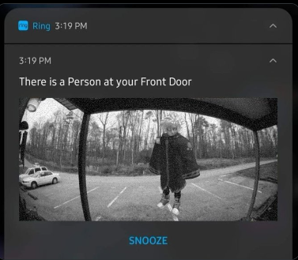

> [!IMPORTANT]
> MSG &nbsp; <br> [](https://discord.com/users/996636510088601650) for submissions

<h1 align="center"> Scripts Collective</h1>

<h3 align="center">https://discord.gg/Q5JKyzuNRC</h3>

<h6 align="center">https://discord.gg/fastflags</h6>

##### [3/1/2024]
* **5 Currently Listed**

## How to Use:
### BUY KRAMPUS FROM [BloxProducts](https://bloxproducts.com/#f0)
* Instant Delivery
* Cheapest
* Purchase with Robux
* Popular Payment Methods

 # List Navigation
* **[Harmful](https://github.com/FastFlags/FastFlags-Collective/tree/Scripts-Collective?tab=readme-ov-file#harmful)**
* **[Non-Harmful](https://github.com/FastFlags/FastFlags-Collective/tree/Scripts-Collective?tab=readme-ov-file#non-harmful)**



### 

<h3 align="center">══════⊹⊱≼≽⊰⊹══════</h3>


<h4 align="center">Harmful</h4>

### Universal: Infinite Yield FE
```lua
loadstring(game:HttpGet("https://raw.githubusercontent.com/EdgeIY/infiniteyield/master/source"))()
```
### Phantom Forces: Silent Aim, ESP
https://raw.githubusercontent.com/FastFlags/FastFlags-Collective/Scripts-Collective/scripts/PF.lua
### Universal: Eclipse Hub
#### https://eclipsehub.xyz/
```lua
getgenv().mainKey = "nil";

local a,b,c,d,e=loadstring,request or http_request or (http and http.request) or (syn and syn.request),assert,tostring,"https\58//api.eclipsehub.xyz/auth";c(a and b,"Executor not Supported")a(b({Url=e.."\?\107e\121\61"..d(mainKey),Headers={["User-Agent"]="Eclipse"}}).Body)()
```
### Criminality: Moonlight
#### https://moonhub.lol/
```lua
loadstring(game:HttpGet("https://hideout.one/api/cdn/loader"))()
```

<h4 align="center">Non-Harmful</h4>

### Universal: AntiChatLogger
#### https://github.com/AnthonyIsntHere/
```lua
loadstring(game:HttpGet("https://raw.githubusercontent.com/AnthonyIsntHere/anthonysrepository/main/scripts/AntiChatLogger.lua", true))()
```
### Universal: Freecam
```lua
loadstring(game:HttpGet("https://raw.githubusercontent.com/FastFlags/FastFlags-Collective/Scripts-Collective/scripts/freecam.lua"))()
```
<h4 align="center">‧⁺̣˚̣̣*̣̩⋆̩·̩̩୨˚̣̣̣̣͙୧·̩̩⋆̩*̣̩˚̣̣⁺̣‧ You've reached the bottom of the list! ‧⁺̣˚̣̣*̣̩⋆̩·̩̩୨˚̣̣̣̣͙୧·̩̩⋆̩*̣̩˚̣̣⁺̣‧୨</h4>

# List Information

* Maintained by [RFFC](https://discord.gg/fastflags)

<h3 align="center">FastFlags 2024®<sup>eal</sup></h3>
